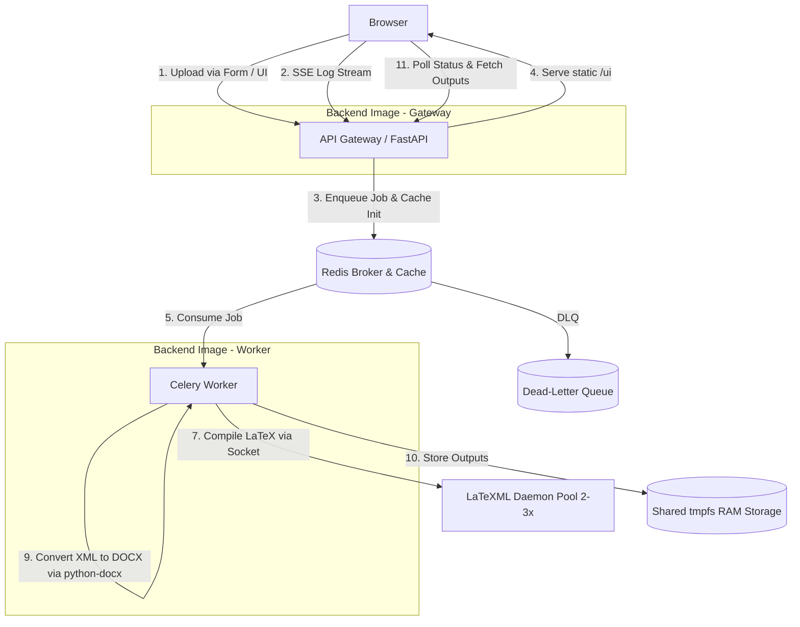

# LaTeX to XML & DOCX Conversion Plan (Optimized Microservices & SoC)

This document outlines the proposed architecture and implementation plan for converting LaTeX (`.tex`) files to structured XML and Microsoft Word (`.docx`) formats. The system follows the **Separation of Concerns (SoC)** principle, is fully containerized using **Docker**, and is optimized for zero-overhead local development and build caching.

---

## 1. Consolidated & High-Performance Microservice Architecture

To reduce system size, network overhead, and startup latency, the system is consolidated into **three container environments** using shared in-memory volumes and daemonized processes. A static frontend (HTML + vanilla JS) is served directly by the API Gateway, eliminating the need for a separate web server or Node.js runtime.



### Breakdown of Services

1. **Redis Service (In-Memory Database):**
   - **Concern:** Task queuing (via Celery), rapid state metadata caching, and dead-letter queue storage.
   - **DLQ Schema:** Failed jobs are stored under `dlq:{task_id}` with the original payload, traceback, and partial outputs. A TTL of 86400s (24h) auto-cleans stale entries.

2. **API Gateway (FastAPI):**
   - **Concern:** HTTP interface, frontend serving, SSE log streaming, health checks, and job orchestration.
   - **Role:** Exposes the REST API and serves the static `index.html` + JS at `/`. Implements an SSE endpoint (`GET /jobs/{id}/logs/stream`) that publishes Celery task log events to the browser in real time. A `/health` endpoint checks Redis connectivity, `latexmls` socket reachability, and `tmpfs` writability on each request.

3. **Celery Worker:**
   - **Concern:** All CPU-bound conversion work.
   - **Role:** Consumes jobs from Redis, converts vector assets, talks to the `latexmls` daemon pool via persistent sockets, parses bibliographies, pre-renders MathML, and generates DOCX via `python-docx`. The worker publishes log lines to a Redis pub/sub channel that the gateway's SSE endpoint subscribes to, enabling live log streaming.

4. **LaTeXML Daemon Pool (`latexmls` x2-3):**
   - **Concern:** LaTeX compilation.
   - **Role:** Instead of spawning a CLI command for each compilation, 2-3 instances of the **LaTeXML Server Daemon** (`latexmls`) run behind a lightweight TCP proxy or are connected to individually by the worker via a connection pool. This avoids Perl startup overhead and allows concurrent compilations. Each daemon uses a trimmed Debian-based TeX Live subset to minimize image size.

5. **Static Frontend (Served by Gateway):**
   - **Concern:** User-facing upload UI and real-time console.
   - **Role:** A single `index.html` with embedded vanilla JS. No build step, no framework, no package manager. The JS opens an SSE connection and renders log lines in a styled terminal widget. On completion, download links for outputs appear.

---

## 2. Shared Storage & Memory Optimizations

### 2.1 In-Memory `tmpfs` Shared Volume
To eliminate disk I/O latency when passing ZIP packages, raw XML, and image assets between the Celery worker and the LaTeXML container, the shared storage directory is configured as a `tmpfs` volume in `docker-compose.yml`:
```yaml
volumes:
  shared-data:
    driver_opts:
      type: tmpfs
      device: tmpfs
      o: "size=256m,uid=1000"
```
This forces all intermediate calculations and file exchanges to occur directly in the host system's RAM.

### 2.2 Redis Data Model Schema
Job metadata is stored in Redis using a Hash key structure: `job:{task_id}`.

In addition, a **Dead-Letter Queue** is maintained under `dlq:{task_id}` with TTL 86400s:
```redis
# On job failure:
SET dlq:{task_id} <json_payload_with_traceback>
EXPIRE dlq:{task_id} 86400
LPUSH dlq:failed_jobs {task_id}
```
The DLQ preserves the original submission payload, partial outputs, and the full Python traceback for post-mortem debugging. A dedicated admin endpoint (`GET /admin/dlq`) lists failed entries, and `POST /admin/dlq/{id}/retry` re-enqueues the job by re-pushing its payload to the main Celery queue.

---

## 3. Local Development & Docker Caching Strategy (No Rebuilds / No Redownloads)

To avoid rebuilding images or re-downloading packages when making changes to the application code, the following strategies are implemented. Additionally, the gateway and worker use **separate runtime images** (sharing a common base layer) to avoid dependency conflicts — the gateway has minimal dependencies (`fastapi`, `uvicorn`, `redis`) while the worker installs heavier packages (`lxml`, `pybtex`, `latex2mathml`, `python-docx`).

### 3.1 Docker Bind Mounts (Instant Code Reloading)
In `docker-compose.yml`, mount local folders into the containers. This allows you to edit Python code on your host machine and have it instantly reflected in the running container without rebuilding the Docker image:
```yaml
services:
  gateway:
    image: backend-service:latest
    volumes:
      - ./backend-service/gateway:/app/gateway
    command: uvicorn gateway.main:app --host 0.0.0.0 --reload

  worker:
    image: backend-service:latest
    volumes:
      - ./backend-service/tasks:/app/tasks
    command: celery -A tasks.celery_app worker --loglevel=info --pool=threads
```
*Hot-reload is enabled via `--reload` for FastAPI. Celery is restarted or configured with development auto-reload, preventing any image rebuilds during coding.*

### 3.2 Dockerfile BuildKit Cache & Layer Ordering
To prevent packages from downloading again during builds, the Dockerfile is structured to cache dependencies:
1. **Layer Order:** Copy only dependency configuration files first, install packages, and *then* copy the source code. Since requirements change rarely compared to code, Docker caches the installation layer.
2. **BuildKit Package Cache:** Use the BuildKit cache mount feature to persist download directories across builds. Even if `requirements.txt` changes, packages that were already downloaded previously are retrieved from the local cache rather than re-downloaded over the network:
```dockerfile
# syntax=docker/dockerfile:1
FROM python:3.11-slim
WORKDIR /app
COPY requirements.txt .
# Persist pip cache across builds
RUN --mount=type=cache,target=/root/.cache/pip \
    pip install -r requirements.txt
COPY . .
```
3. **Version Pinning:** All packages in `requirements.txt` are pinned to exact versions (e.g., `lxml==5.3.0`, `python-docx==1.1.2`) to prevent silent breakage from upstream releases. Dependabot or Renovate is recommended for automated updates.

---

## 4. Workspace & Directory Structure

```text
/texDocx
├── docker-compose.yml
├── frontend/
│   └── index.html          # Single-page app: upload form + terminal console + download links
├── backend-gateway/
│   ├── Dockerfile
│   ├── requirements.txt    # Minimal: fastapi, uvicorn, redis
│   └── gateway/
│       ├── __init__.py
│       ├── main.py         # FastAPI app: routes, SSE endpoint, static mount, /health
│       └── routes/
│           ├── __init__.py
│           ├── jobs.py     # Submit, status, logs, stream endpoints
│           └── admin.py    # DLQ listing and retry endpoints
├── backend-worker/
│   ├── Dockerfile          # Shares base layer with gateway, adds heavy deps
│   ├── requirements.txt    # Heavy: lxml, pybtex, latex2mathml, python-docx
│   └── tasks/
│       ├── __init__.py
│       ├── celery_app.py   # Celery app config
│       ├── compiler.py     # latexmls socket client
│       ├── images.py       # EPS/PDF -> PNG/SVG conversion
│       ├── bibliography.py # .bib parsing
│       ├── math.py         # MathML pre-rendering
│       └── docxgen.py      # JATS XML -> python-docx mapping
└── latexml-service/
    ├── Dockerfile          # Installs Perl, LaTeXML, and minimal TeX Live subset
    ├── app/
    │   └── daemon.py       # Runs latexmls, exposes socket on port 3334
    └── supervisord.conf    # Runs 2-3 latexmls instances behind a TCP proxy
```

---

## 5. Implementation Phases

### Phase 1: Shared Base Layer & Backend Images
- Create `python:3.11-slim` base layer with common system packages.
- Create `backend-gateway/Dockerfile` and `backend-worker/Dockerfile`, both starting from the same base layer.
- Pin all versions in both `requirements.txt` files.
- Use BuildKit `--mount=type=cache` for pip.

### Phase 2: LaTeXML Daemon Pool
- Configure the `latexml-service` to start 2-3 `latexmls` instances on container boot via supervisord, listening on ports 3334-3336.
- Implement a lightweight TCP proxy (or round-robin in the worker) to distribute connections across the pool.
- Add socket health-check retry logic in the worker.

### Phase 3: API Gateway — Health & SSE Endpoints
- Implement `GET /health` returning JSON with Redis ping, `latexmls` socket probe, and `tmpfs` write test.
- Implement `GET /jobs/{id}/logs/stream` as an SSE endpoint. The gateway subscribes to a Redis pub/sub channel (`log:{task_id}`) and forwards events to the browser. On completion, a `complete` event signals the client to stop listening.

### Phase 4: Static Frontend
- Create `frontend/index.html` with embedded CSS and vanilla JS (no build step).
- **Upload form:** file input + macros textarea + format dropdown + submit button.
- **On submit:** POST multipart to `/jobs/submit`, receive `task_id`, start SSE and status poll.
- **Console widget:** fixed-height `<div>` with `font-family: monospace`, dark background, auto-scroll. SSE `log` events append color-coded lines (Info=#ccc, Warning=#ffd700, Error=#ff4444, Fatal=#ff00ff).
- **On complete:** hide spinner, show download links for `.xml`, `.docx`, `.log`. On failure, show error summary + retry button that re-uploads without page reload.

### Phase 5: Post-Processing & python-docx Mapping
- Walk the XML tree recursively and map elements to `python-docx`:
  - `<sec>` -> `doc.add_heading(level=...)`
  - `<p>` -> `doc.add_paragraph(...)`
  - `<table-wrap>` -> `doc.add_table(...)`
  - Inline MathML elements -> converted to Office Math XML markup and injected directly into paragraphs.

### Phase 6: Dead-Letter Queue & Admin Endpoints
- On job failure in the Celery worker, serialize the original payload, partial outputs, and traceback to `dlq:{task_id}` in Redis.
- Push the `task_id` to a `dlq:failed_jobs` list for enumeration.
- Implement `GET /admin/dlq` (paginated list) and `POST /admin/dlq/{id}/retry` in `backend-gateway/gateway/routes/admin.py`.
