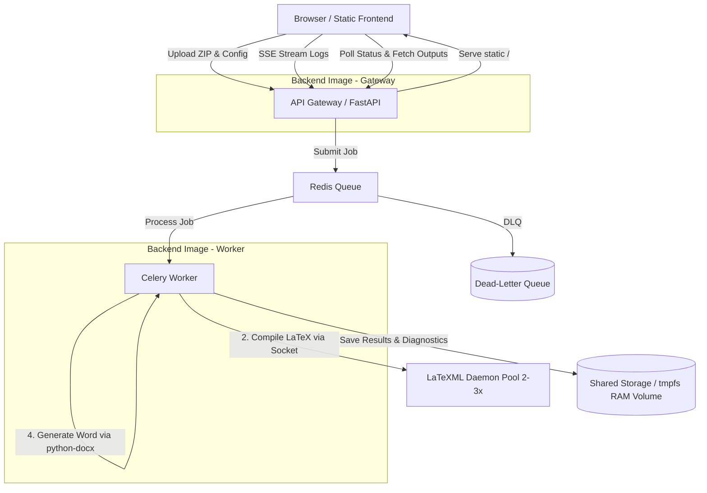

# Software Requirements Specification (SRS)
## Project: LaTeX to XML & DOCX Conversion Pipeline (Optimized Dockerized Architecture)

---

## 1. Introduction

### 1.1 Purpose
This document specifies the software requirements for the LaTeX-to-XML & DOCX Conversion Pipeline. It outlines the functional and non-functional requirements, system architecture, and constraints. This document serves as the primary reference for developers, testers, and system administrators.

### 1.2 Scope
The system is a highly optimized, dockerized application designed to convert LaTeX (`.tex`) documents into structured XML (JATS/TEI) and Microsoft Word (`.docx`) files. It operates **asynchronously** using a Redis task queue, handles conversion of embedded vector assets, resolves bibliography citation mapping, pre-renders math equations, and parses warning logs. The runtime environment is optimized down to **three container workloads** sharing a single Python backend base image, utilizing **python-docx** for Word rendering, running the **LaTeXML daemon** (`latexmls`) for fast parsing, and utilising **in-memory tmpfs storage** to eliminate disk I/O latency. Build layers and local directory mounts are configured to prevent rebuilding and package redownloads during development.

### 1.3 Definitions, Acronyms, and Abbreviations
* **SoC:** Separation of Concerns
* **SRS:** Software Requirements Specification
* **JATS:** Journal Article Tag Suite
* **MathML:** Mathematical Markup Language
* **DOCX:** Microsoft Word Open XML Document format
* **EPS/PDF:** Encapsulated PostScript / Portable Document Format
* **Redis:** In-memory data structure store used as a broker and status cache
* **tmpfs:** In-memory temporary file system
* **latexmls:** The daemon version of the LaTeXML compiler
* **API:** Application Programming Interface
* **DTD/XSD:** Document Type Definition / XML Schema Definition
* **python-docx:** Python library for programmatically generating Word documents
* **Bind Mount:** A Docker volume configuration mapping host files directly into container runtimes
* **SSE:** Server-Sent Events — a standard allowing servers to push real-time updates to HTTP clients
* **DLQ:** Dead-Letter Queue — a secondary queue for storing failed messages for later inspection

---

## 2. Overall Description

### 2.1 Product Perspective
The system is optimized for low memory footprint and high execution speed. The API Gateway and Celery worker run as separate Docker images sharing a common base layer, avoiding dependency conflicts while preserving build cache efficiency. File transfers are executed entirely in-memory using `tmpfs` RAM volumes, and LaTeX compilation is delegated to a pool of persistent LaTeXML daemon instances (`latexmls`) to eliminate Perl initialization overhead and enable concurrent compilations. A static frontend (HTML + vanilla JS) is served directly by the Gateway, and real-time compilation logs are streamed to the browser via Server-Sent Events. Failed jobs are preserved in a Redis-backed dead-letter queue for post-mortem debugging and retry.

### 2.2 Product Functions
* Accept `.tex` files or zipped source bundles via a browser-based web UI.
* Queue and manage conversion tasks asynchronously.
* Convert vector media assets (`.eps`, `.pdf`) into web-compatible raster (`.png`) or scalable vector formats (`.svg`) directly within the worker processes.
* Support user-provided dynamic macro declarations injected at compile-time.
* Compile LaTeX markup into raw XML using the daemonized LaTeXML server.
* Parse compilation warnings/errors and map them to line numbers.
* Extract bibliographies from `.bib` files, converting references into semantically structured JATS XML citation nodes.
* Pre-render MathML equations into inline SVG/PNG images.
* Transform structured XML into a styled Microsoft Word (`.docx`) file using python-docx.
* Deliver the completed XML, DOCX, and error diagnostic logs to the client.
* Stream real-time compilation logs to the browser via SSE, displayed in a terminal-style console widget.
* Expose a health/readiness endpoint for container orchestration and monitoring.

### 2.3 Operating Environment
* **Platform:** Docker Engine / Docker Compose (cross-platform).
* **Base OS inside Containers:** Debian/Ubuntu (LaTeXML, and ImageMagick/Ghostscript tools).

---

## 3. System Features & Functional Requirements

### 3.1 API Gateway & Endpoint Specifications
* **FR-1.1:** The system MUST expose a REST API with the following endpoints:

#### Endpoint 1: Submit Job
* **Path:** `POST /jobs/submit`
* **Content-Type:** `multipart/form-data`
* **Parameters:**
  - `file`: A zip file containing the `.tex` documents, `.bib` files, and assets (Required).
  - `format`: String (`xml` | `docx` | `all`) (Optional, Default: `all`).
  - `macros`: JSON string containing key-value mappings of custom macros (Optional).
* **Response (HTTP 202 Accepted):**
  ```json
  {
    "task_id": "c8b321a6-a4c3-4d43-85ee-f302f3bc191b",
    "status": "PENDING",
    "submitted_at": "2026-07-04T17:39:00Z"
  }
  ```

#### Endpoint 2: Fetch Job Status
* **Path:** `GET /jobs/{id}/status`
* **Response (HTTP 200 OK):**
  ```json
  {
    "task_id": "c8b321a6-a4c3-4d43-85ee-f302f3bc191b",
    "status": "PROCESSING",
    "progress_percent": 45,
    "updated_at": "2026-07-04T17:39:15Z"
  }
  ```

#### Endpoint 3: Fetch Job Logs/Diagnostics
* **Path:** `GET /jobs/{id}/logs`
* **Response (HTTP 200 OK):**
  ```json
  {
    "task_id": "c8b321a6-a4c3-4d43-85ee-f302f3bc191b",
    "warnings": [
      {
        "line_number": 42,
        "severity": "Warning",
        "message": "Undefined control sequence \\mycustommacro"
      }
    ]
  }
  ```

#### Endpoint 4: Stream Job Logs (SSE)
* **Path:** `GET /jobs/{id}/logs/stream`
* **Response (HTTP 200 OK):** Server-Sent Events stream
  ```
  event: log
  data: {"timestamp": "2026-07-04T17:39:10Z", "line_number": 15, "severity": "Info", "message": "Parsing LaTeX source..."}

  event: log
  data: {"timestamp": "2026-07-04T17:39:12Z", "line_number": 42, "severity": "Warning", "message": "Undefined control sequence \\mycustommacro"}

  event: complete
  data: {"task_id": "c8b321a6-...", "status": "SUCCESS"}
  ```
* **Note:** SSE is chosen over WebSocket for simplicity — it uses standard HTTP, works through all proxies, and requires no special handshake logic.

#### Endpoint 5: Health Check
* **Path:** `GET /health`
* **Response (HTTP 200 OK):**
  ```json
  {
    "status": "healthy",
    "redis": "connected",
    "latexmls": "reachable",
    "tmpfs": "writable",
    "uptime_seconds": 84321
  }
  ```

#### Endpoint 6: Serve Frontend
* **Path:** `/` or `GET /ui`
* **Response:** Static `index.html` with embedded JS application.

### 3.2 Media Asset & Math Render Processing (In-Process Worker)
* **FR-2.1:** The backend worker MUST scan incoming packages and convert vector formats (`.eps`, `.pdf`) to `.png`/`.svg` inline via system bindings.
* **FR-2.2:** The backend worker MUST pre-render MathML equations to inline SVG format using Python math engines without spawning external container processes.

### 3.3 LaTeX Parsing (LaTeXML Daemon)
* **FR-3.1:** The compiler service MUST run as a persistent daemon process (`latexmls`) listening on a socket/port to avoid Perl reload latency.
* **FR-3.2:** The service MUST accept client-defined dynamic macros at runtime and pre-load them as packages before LaTeX compilation.
* **FR-3.3:** The service MUST capture compiler `stderr` output during compilation, parsing warnings and errors from the logs into a structured JSON array containing `line_number`, `severity` (Warning/Error/Fatal), and `message`.

### 3.4 Post-Processing, Bibliography Parsing & DOCX Conversion (In-Process Worker)
* **FR-4.1:** The backend worker MUST parse citation bibliography source files (`.bib`) and map entries to structured JATS bibliography nodes (`<element-citation>`).
* **FR-4.2:** The backend worker MUST parse JATS XML and map its tag structure directly to Word paragraphs, runs, tables, and sections using **python-docx**.
* **FR-4.3:** The backend worker MUST convert MathML equations into Office Math XML elements and insert them directly into the generated DOCX file.

### 3.5 Frontend Web Interface
* **FR-5.1:** The system MUST serve a single-page web application (HTML + vanilla JS) at the root URL.
* **FR-5.2:** The frontend MUST provide a file upload form accepting `.tex` files or `.zip` bundles, with an optional macros JSON text area and format selector (`xml` / `docx` / `all`).
* **FR-5.3:** Upon submission, the frontend MUST display the assigned `task_id` and begin polling the status endpoint at a configurable interval (default 2s).
* **FR-5.4:** The frontend MUST open an SSE connection to `GET /jobs/{id}/logs/stream` and render incoming log lines in a fixed-height, scrollable, terminal-style console widget styled with a dark background and monospace font.
* **FR-5.5:** Log lines MUST be color-coded by severity: Info (white/gray), Warning (yellow), Error (red), Fatal (magenta).
* **FR-5.6:** Upon job completion, the frontend MUST display download links for the generated XML, DOCX, and full diagnostic log files.
* **FR-5.7:** The frontend MUST gracefully handle job failure by displaying the error summary in the console and enabling the user to resubmit without a full page reload.

### 3.6 Dead-Letter Queue & Failure Isolation
* **FR-6.1:** The system MUST maintain a secondary Redis list keyed as `dlq:{task_id}` for jobs that fail irrecoverably.
* **FR-6.2:** On failure, the original submission payload, error traceback, and partial outputs MUST be preserved in the DLQ entry for at least 24 hours.
* **FR-6.3:** The system MUST expose a `GET /admin/dlq` endpoint to list failed jobs and a `POST /admin/dlq/{id}/retry` endpoint to re-enqueue a failed job.

### 3.7 LaTeXML Connection Pool
* **FR-7.1:** The worker MUST maintain a small pool of persistent `latexmls` socket connections (default: 2-3) to handle concurrent conversion tasks without queuing at the daemon level.
* **FR-7.2:** If all daemon slots are busy, the worker MUST wait with a bounded timeout rather than opening an unbounded number of connections.

---

## 4. Data Storage & Orchestration Model

### 4.1 Redis Cache Schema
Job metadata is stored in Redis using a Hash key structure: `job:{task_id}`.

### 4.2 In-Memory Shared Storage (tmpfs)
* **Requirement:** The shared storage directory used to exchange documents between the Celery worker and the `latexmls` container MUST be mounted as an in-memory `tmpfs` volume. Disk writes are strictly prohibited during intermediate conversion stages.

---

## 5. Architectural Design & Shared Image Model

The system utilizes a consolidated docker network with four active services, with the gateway and worker using separate runtime images to avoid dependency conflicts while sharing a common base layer for build cache efficiency.



---

## 6. Development & Caching Requirements

### 6.1 Docker Build Optimization (No Redownloads)
* **Requirement:** Each backend Dockerfile MUST utilize BuildKit package cache mounts (`--mount=type=cache,target=/root/.cache/pip`) during the package installation step. This ensures that changing local project files or adding new packages does not trigger a full download of pre-existing python packages.
* **Requirement:** Dockerfile commands MUST be ordered with dependencies (`requirements.txt` copying and installation) placed before application source code copying, ensuring layer caches remain valid during code edits.
* **Requirement:** All Python dependencies in `requirements.txt` MUST be pinned to exact versions to prevent silent breakage from upstream releases.
* **Requirement:** The gateway and worker images MUST start from the same base layer but install separate dependency sets — minimal for the gateway (`fastapi`, `uvicorn`, `redis`), heavier for the worker (`lxml`, `pybtex`, `latex2mathml`, `python-docx`).

### 6.2 Hot-Reloading (No Container Rebuilds)
* **Requirement:** In development configurations, application code files MUST be mapped into container runtimes using bind mounts (`volumes` mapping in `docker-compose.yml`).
* **Requirement:** API gateway services MUST execute using live reload parameters (e.g., `uvicorn --reload`) to immediately execute host-side code alterations without rebuilding images or restarting containers.

---

## 7. Non-Functional Requirements

### 7.1 Performance & Scalability
* **NFR-1.1:** Task submission response time MUST be under 500ms.
* **NFR-1.2:** Large papers (up to 50 pages) with image assets MUST compile and render math templates within 90 seconds.
* **NFR-1.3:** The system MUST compile a standard 10-page document (with no changed assets) in under 5 seconds by utilizing the `latexmls` daemon and `tmpfs` shared RAM volumes.

### 7.2 Reliability
* **NFR-2.1:** If an image conversion or MathML rendering step fails, the pipeline MUST proceed using text-only or fallback ASCII representations instead of crashing the compilation task.
* **NFR-2.2:** System logs MUST categorize all parser warnings dynamically to help users troubleshoot formatting discrepancies.

### 7.3 Dependency & Build Integrity
* **NFR-3.1:** All Python package dependencies in `requirements.txt` MUST be pinned to exact versions (e.g., `lxml==5.3.0`) to prevent silent breakage from upstream releases.
* **NFR-3.2:** Docker images MUST specify a full version tag for the base image (e.g., `python:3.11-slim`) without using the `latest` tag.

### 7.4 Maintainability
* **NFR-4.1:** The API gateway and Celery worker SHOULD maintain separate runtime images to avoid dependency conflicts within the same process space, but MAY share a common base layer for build cache efficiency.
* **NFR-4.2:** Internal module boundaries between gateway route logic and worker task logic MUST be enforced to prevent circular imports when scaling to separate containers.
